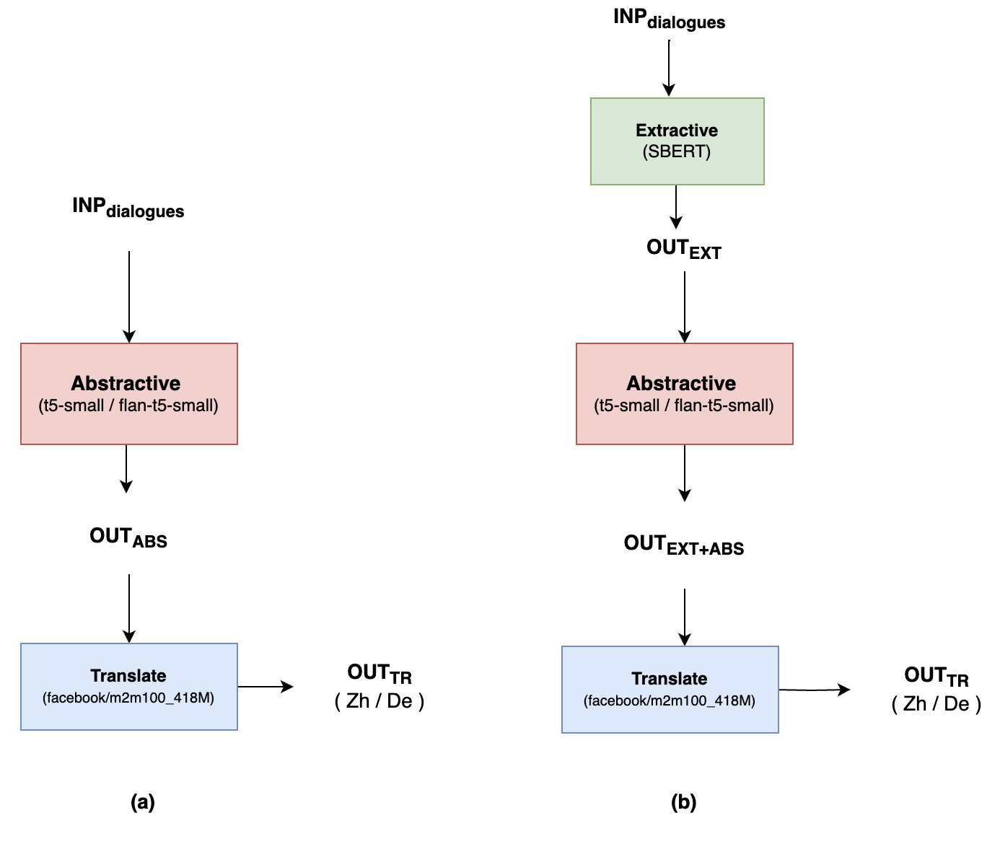
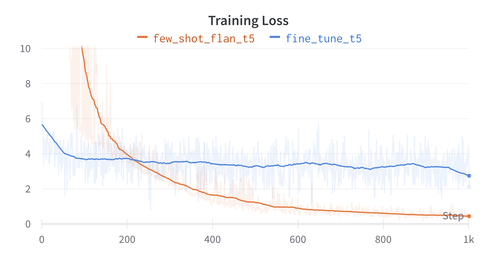

# CS577_Project

Data used for training the models both Few Shot and Fine Tuning is taken from the hugging face, <a href=https://huggingface.co/datasets/GEM/xmediasum><b>GEM/xmediasum</b></a>

This note presents a novel approach to crosslingual summarization tasks- extraction and abstraction combined. We explore approaching the summarization task using plain abstraction or a combination of extraction and abstraction, followed by which the summaries are translated into two languages (Chinese and German). We also explore two approaches- a few-shot approach and a fine-tuned approach. Furthermore, we experiment with the best-performing dialogue-to-extractive-summary ratio for the given data set. We conclude that (i) combination of extractive and abstractive summarization results in the better performance than plain abstractive summarization (ii) the optimal dialogue-to-extractive-summary ratio for extraction was found to be 0.5 (iii) the few-shot model showed most efficient results, as compared to the fine-tuned model. We present loss curves along with comparative performance metrics to conclude that the few-shot model with extraction (SBERT with summarization ratio- 0.5) and abstraction (flan-t5-small) worked best for the cross-lingual data set.

## Architecture

 
   

## Loss Comparision: Few Shot Model vs Fine Tune Model

 
   

